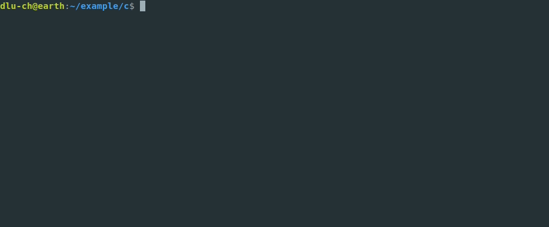

|logo|

Explicit is better than implicit
================================

|batch-buildtest| |batch-doc| |batch-cov| |batch-pypi-python| |batch-pypi|

dlb is a `Pythonic <https://www.python.org/dev/peps/pep-0020/>`_
`build tool <https://en.wikipedia.org/wiki/Build_tool>`_ that does not try to mimic
`Make <https://en.wikipedia.org/wiki/Make_%28software%29>`_ but to leverage the power of object-oriented languages.

It requires at least Python 3.7 (and nothing else).

Who should use dlb?

- Short answer: you.
- Long answer: `here <https://dlb.readthedocs.io/en/latest/faq.html#who-should-use-dlb>`_.

|demo-c|

dlb itself is completely tool-agnostic (it does not contain a single line of code specific to a tool or
programming language).

It comes with a separate Python package ``dlb_contrib`` that contains abstractions and examples for a wide range of
common tools like GCC, MSVC, GNU Binutils, Git, Doxygen, LaTeX, as well as utilities for code generation,
API versioning etc.

See here for more: https://dlb.readthedocs.io/.

.. |batch-buildtest| image:: https://github.com/dlu-ch/dlb/actions/workflows/build-and-test.yml/badge.svg?branch=master
   :alt: Build status (tests)
   :target: https://github.com/dlu-ch/dlb/actions/workflows/build-and-test.yml

.. |batch-doc| image:: https://readthedocs.org/projects/dlb/badge/?version=latest
   :alt: Documentation status (Sphinx)
   :target: https://dlb.readthedocs.io/

.. |batch-cov| image:: https://coveralls.io/repos/github/dlu-ch/dlb/badge.svg?branch=master
   :alt: Test coverage status
   :target: https://coveralls.io/github/dlu-ch/dlb?branch=master

.. Update of coveralls.io badge in GitHub's cache
   curl -X PURGE https://camo.githubusercontent.com/...
   https://help.github.com/en/github/authenticating-to-github/about-anonymized-image-urls

.. |batch-pypi-python|  image:: https://img.shields.io/pypi/pyversions/dlb
   :alt: Officially supported Python versions
   :target: https://pypi.python.org/pypi/dlb

.. |batch-pypi|  image:: https://img.shields.io/pypi/v/dlb
   :alt: PyPI project
   :target: https://pypi.python.org/pypi/dlb
