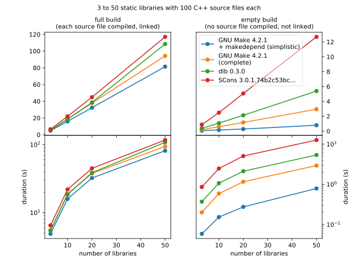
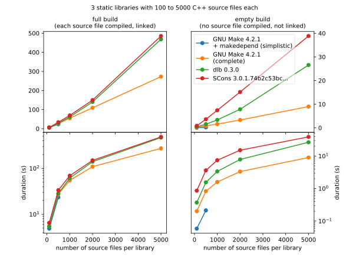

Frequently asked questions
==========================

Why another build tool?
-----------------------

A common answer to a common question: Because none of the available tools met the requirements of the author,
especially for the development of embedded software with cross-compiler toolchains and generated source code.

   +----------------------------------------+---------------+---------------+---------------+---------------+
   | (Desirable) property                   | dlb           | Make          | SCons         | Ninja         |
   +========================================+===============+===============+===============+===============+
   | Speed of full build (huge project)     | |avg|         | |plusplus|    | |avg|         | |plusplus|    |
   +----------------------------------------+---------------+---------------+---------------+---------------+
   | Speed of partial or "empty" build      | |plus|        | |plusplus|    | |minus|       | |plusplus|    |
   +----------------------------------------+---------------+---------------+---------------+---------------+
   | Avoidance of unnecessary execution     | |plusplus|    | |minusminus|  | |plus|        | |plus|        |
   | of tools                               |               |               |               |               |
   +----------------------------------------+---------------+---------------+---------------+---------------+
   | Accuracy of automatically detected     | |plusplus|    | |none|        | |plus|        | |none|        |
   | input dependencies                     |               |               |               |               |
   +----------------------------------------+---------------+---------------+---------------+---------------+
   | Expressiveness of build description    | |plusplus|    | |minusminus|  | |avg|         | |avg|         |
   +----------------------------------------+---------------+---------------+---------------+---------------+
   | Portability of build description       | |plusplus|    | |minusminus|  | |avg|         | |minus|       |
   +----------------------------------------+---------------+---------------+---------------+---------------+
   | Modularity                             | |plusplus|    | |minusminus|  | |minus|       | |avg|         |
   +----------------------------------------+---------------+---------------+---------------+---------------+
   | Robustness to system time jumps        | |plus|        | |minusminus|  | |plusplus|    | |minusminus|  |
   +----------------------------------------+---------------+---------------+---------------+---------------+
   | Robustness to changes during build     | |plusplus|    | |minusminus|  | |plusplus|    | |minusminus|  |
   +----------------------------------------+---------------+---------------+---------------+---------------+
   | Simplicity of separation between input | |plusplus|    | |minusminus|  | |plus|        | |avg|         |
   | and output directories                 |               |               |               |               |
   +----------------------------------------+---------------+---------------+---------------+---------------+
   | Reproducibility of builds              | |plusplus|    | |minusminus|  | |minusminus|  | |minusminus|  |
   +----------------------------------------+---------------+---------------+---------------+---------------+
   | Fine-grained control                   | |plusplus|    | |minusminus|  | |minusminus|  | |minusminus|  |
   | of parallel execution                  |               |               |               |               |
   +----------------------------------------+---------------+---------------+---------------+---------------+
   | Abstraction of tools                   | |plusplus|    | |minusminus|  | |minus|       | |avg|         |
   +----------------------------------------+---------------+---------------+---------------+---------------+
   | Self-containedness                     | |plusplus|    | |minusminus|  | |plusplus|    | |minusminus|  |
   +----------------------------------------+---------------+---------------+---------------+---------------+
   | Possibility to step through build      | |plus|        | |minusminus|  | |minus|       | |minusminus|  |
   | with debugger                          |               |               |               |               |
   +----------------------------------------+---------------+---------------+---------------+---------------+
   | Safe use of paths containing "special" | |plusplus|    | |minusminus|  | |minus|       | |minus|       |
   | characters (``' '``,  ``'$'``,         |               |               |               |               |
   | ``'\\'``, ...)                         |               |               |               |               |
   +----------------------------------------+---------------+---------------+---------------+---------------+
   | Ability to deal with circular          | |plusplus|    | |minusminus|  | |minusminus|  | |minusminus|  |
   | dependencies                           |               |               |               |               |
   +----------------------------------------+---------------+---------------+---------------+---------------+
   | Fundamental objects                    | contexts,     | strings       | environments, | strings,      |
   |                                        | tools, paths  |               | strings,      | string lists  |
   |                                        |               |               | string lists  |               |
   +----------------------------------------+---------------+---------------+---------------+---------------+

dlb has the unique ability to *enforce* requirements instead of just *assuming* them.
This makes dlb not only a build tool but also a tool for quality control.
For example: You can check the design decision that library A in your project must not depend on library B
every time library A is built and use this guarantee (not just assumption!) to reduce the build time.

See the following questions for a comparison to Make, Ninja and SCons.

There is plethora of other build tools:

- https://en.wikipedia.org/wiki/List_of_build_automation_software
- https://pypi.org/search/?c=Topic+%3A%3A+Software+Development+%3A%3A+Build+Tools

They fall into two large categories which both have major shortcomings in the view of the author.

Tools based on declared dependency rules
^^^^^^^^^^^^^^^^^^^^^^^^^^^^^^^^^^^^^^^^

Most of them implement the functionality of Make in a more readable descriptive language
and improve the modularity and the ability to split large projects into smaller ones.

See :ref:`here <manual-explicit-is-better-than-implicit>` why a descriptive language is not the best approach to
describe a build process.

Examples are:

- `Apache Ant <https://ant.apache.org/>`_ (XML, Java-centric)
- https://pypi.org/project/doit/ (Python)
- https://mesonbuild.com/ (Python)
- https://pypi.org/project/faff/ (Python, "An input file similar to a Makefile defines rules")
- https://pypi.org/project/Aap/ (Python)
- https://pypi.org/project/pyb/ (Python, "Modelled after Ant")
- https://pypi.org/project/csbuild/ (Python, for fast incremental building of C(++) projects)
- https://pypi.org/project/mkcode/ (Python)
- https://pypi.org/project/bold/ (Python, C-centric)
- https://pypi.org/project/buildit/ (Python, .ini-file syntax to describe rules)
- `Bruce Eckel's builder.py <https://www.artima.com/weblogs/viewpost.jsp?thread=241209>`_ (Python)

Of these, SCons and doit are closest to the goals of this project.

Tools based on directory structure
^^^^^^^^^^^^^^^^^^^^^^^^^^^^^^^^^^

Some build tools are specialized in organizing large projects, fetching files from different
sources, packaging and publishing the build products.
They usually do so by imposing a certain directory structure and assign files a given meaning
based on this structure.

These tools are heavy, complex and restrictive.
A build tool should be simple and flexible.

Examples are:

- `Apache Maven <https://maven.apache.org/>`_ (XML, Java-centric)
- https://www.pantsbuild.org/
- http://www.buildout.org/

Who should use dlb?
-------------------

You should *not* use dlb if:

- You are proud to have mastered a flavour of Make + sh + makedepend + automake + autoconf + find + xargs + grep +
  sed + awk + ...  and happily run a ``make clean-all`` now and then --- because that's what you do.
  You cannot understand the need for an alternative.
- You are happy with your IDE and build all your software with :kbd:`Ctrl+Shift+B`.
- You do not know Python and are not willing to learn it.
- You do not have to build your code on several machines (i.e. you work alone).
- You do not care about portability and quality.
- Your project is huge, everything depends on everything, and its individual parts cannot be tested in isolation
  (i.e. it is poorly designed).
- Your project is mostly built from scratch and extremely often (like FreeBSD ports or Linux kernels built by users for
  installation). Even a build time increase as low as 5% would --- cumulated --- mean a massive waste of (life) time
  and energy.

Otherwise, you should give dlb a try. Especially if:

- You build the same project on several platforms (e.g. GNU/Linux and MS Windows).
- You need to generate source code (e.g. a header file with version information).
- You love the elegance and power of Python.
- You use a not-so-common compiler toolchain and want to control every aspect
  of code generation (e.g. for embedded software where code size matters).
- You have to make sure your software can be reproduced exactly in 10 years.
- Your build process consists of sequential steps whose dependencies cannot easily be described by an acyclic
  graph (you currently use a shell script to combine them).
- You lost enough time with missing dependencies: You just tested a bunch of small code modification based on
  each other, carefully tested the output for each of them and committed them to the repository. Only to realize that
  the first of them introduced a bug (you did not notice it because your build tool did not regenerate *all* the
  dependent files).

.. _manual-speed-comparison:

How fast is dlb?
----------------

There is a lot of controversy in comparing the speed of build tools in general and SCons in particular.

In my opinion, raw speed for a single build in an ideal and static environment is not the most important benchmark for
productivity; the necessary total effort to develop and maintain a trustworthy and complete build description is
far from negligible. Spending hours to find subtle flaws in the build process and doing complete rebuilds out of
mistrust in the completeness of the dependency information costs more than a few seconds per --- otherwise perfect ---
partial build. [#makepitfall1]_

Having said that, here are the results of a simple benchmark used both
`against <http://gamesfromwithin.com/the-quest-for-the-perfect-build-system>`_ and
`in defense of <https://github.com/SCons/scons/wiki/WhySconsIsNotSlow>`_ SCons
(which means it has some significance):

Remarks:

- Each source file defines one C++ class and includes 15 files from its own library as well as 5 files from
  other libraries. Each library depends on every other library (in other words: the benchmark scenario represents a
  very poorly designed project).
- The generated simplistic GNU Makefiles contain static lists of files while SCons and dlb find the files at run-time
  and miss a lot of dependencies (labeled ``simplistic``).
- :command:`makedepend` (used in a rule of the simplistic GNU Makefiles) crashes for very large numbers of classes.
- A build with GNU Makefiles that describes the dependencies completely was added for comparison.
- The dlb performance is given for three styles of the dlb script (all describe the dependencies completely):

  - ``dlb``: straight-forward
  - ``dlb (grouped)``: 5 source files per tool instance
  - ``dlb (hierarchical)``: assume a monotonic system time as Make does

- The complete code of the benchmark is here: `test/benchmark/`_.

Properties of tested builds (*n*: number of libraries, *m*: number of source files per library):

   +-----------------------------------+-------------------------+-------------------------------+-----------------------+--------------------+----------------+-------------------+
   |                                   | GNU Make +              | GNU Make                      | dlb                   | dlb                | dlb            | SCons             |
   |                                   | makedepend (simplistic) |                               |                       | (grouped)          | (hierarchical) |                   |
   +===================================+=========================+===============================+=======================+====================+================+===================+
   | Describes dependencies completely | |none|                  | |check|                       | |check|               | |check|            | |check|        | |check|           |
   +-----------------------------------+-------------------------+-------------------------------+-----------------------+--------------------+----------------+-------------------+
   | Can be aborted without corruption | |none|                  | |check|                       | |check|               | |check|            | |check|        | |none|            |
   | of output                         |                         |                               |                       |                    |                |                   |
   +-----------------------------------+-------------------------+-------------------------------+-----------------------+--------------------+----------------+-------------------+
   | Does not depend on monotonic      | |none|                  | |none|                        | |check|               | |check|            | |none|         | |check|           |
   | system time                       |                         |                               |                       |                    |                |                   |
   +-----------------------------------+-------------------------+-------------------------------+-----------------------+--------------------+----------------+-------------------+
   | Size of build description         | 7 + *n* (*m* + 20)      | 188 + *n*                     | 25                    | 37                 | 51             | 1 + *n* (*m* + 4) |
   | (number of non-trivial lines)     |                         |                               |                       |                    |                |                   |
   +-----------------------------------+-------------------------+-------------------------------+-----------------------+--------------------+----------------+-------------------+
   | Based on                          |                         | `example/c-minimal-gnumake/`_ | `example/c-minimal/`_ | `example/c-huge/`_ |                |                   |
   +-----------------------------------+-------------------------+-------------------------------+-----------------------+--------------------+----------------+-------------------+

.. _manual-make-comparison:

How does dlb compare to Make?
-----------------------------

The concept of Make originates from an era when running an interpreter like Python was too slow to be productive.
Its authors sacrificed readability and correctness to speed.

It is very easy to write extremely fast, incomplete, unreproducible and unportable Makefiles.
It is very hard to write *complete* (all dependencies are covered) and *reproducible* (the output is the same
for the same input) Makefiles.
It is impossible to write *portable* Makefiles. [#makeportability1]_
It is possible but time-consuming to write Makefiles that clearly describe and check their requisites and assumptions.

There is a reason why there are so many flavours of Make and so many utilities that generate Makefiles.

In contrast, it is very easy to write fast, complete, reproducible and portable :term:`dlb scripts <script>`.
dlb does not guess or assume, but requires the explicit statement of information to be used by external tools
(the expected content of environment variables, for example). This results in readable and self-documenting dlb scripts
that concisely describe their requisites and assumptions.

Make is significantly faster than dlb when only a small fraction of the output dependencies has to be generated
(Make: only a few sources are newer than their targets).
The available Make implementations have been carefully optimized for speed over the years.
dlb is executed by an instance of a Python interpreter; starting a Python interpreter and importing some modules
typically takes approximately 70 ms.

Make executes a rule's command if one of the rule's source has a later :term:`mtime` than any of the the rule's
targets (or if one of the output dependencies does not exist).
A Make build can therefore silently miss the update of a rule's target, if one of the following (implicit) requirements
is violated:

1. The :term:`mtime` of each involved filesystem object never decreases.
2. The :term:`mtime` of each involved filesystem object is in the past when the build starts.

Make *requires* that each output dependency (target) changes when one of its input dependencies (sources) has changed.
Fixing a typo in a comment of a :file:`.c` file necessarily leads to compilation, linking and all dependent
actions, whereas in dlb the cascade stops with the first file that does not change.
Since a typical dlb script describes the dependencies completely while a typical Makefile does not,
you won't so easily find yourself in the position with dlb where you have to remove all output dependencies and build
from scratch.

Compare `example/c-minimal/`_ and `example/c-minimal-gnumake/`_.

How does dlb compare to Ninja?
------------------------------

Ninja_'s mission statement reads:

  Ninja is a small build system with a focus on speed.
  It differs from other build systems in two major respects: it is designed to have its input files generated by
  a higher-level build system, and it is designed to run builds as fast as possible.

This is a clever choice. Ninja files have a elegant and well-defined syntax.
This means: Wherever Make is suitable Ninja is better.

Despite its claim, Ninja has hardcoded support for compiler interfaces specific to GCC, Clang and MSVC as well as
a file-based mechanism for dependency detection at build time.

Like Make, Ninja executes a rule's command if one of the input dependencies have a later :term:`mtime` `than any of the
output dependencies <https://github.com/ninja-build/ninja/blob/v1.10.0/src/build.cc#L507>`_ (or if one of the output
dependencies does not exist). It therefore shares the risks of Make related to system time changes and file changes
during a build.

Ninja (similar to dlb) detects outputs `unchanged by a rule's command
<https://github.com/ninja-build/ninja/blob/v1.10.0/src/build.cc#L979>`_.

As stated above, Ninja is meant to work as part of a higher-level build system that automatically generates Ninja files.
[#ninjafilegenerators1]_
Rōnin_ is such a higher-level build system. It has a structure similar to dlb and can therefore be part of a
:term:`dlb script <script>`.
However, Rōnin shares the typical :ref:`limitations <manual-explicit-is-better-than-implicit>` of declarative build
descriptions; it performs a lot of "magic" (with undocumented assumptions) and cannot be extended beyond the hardcoded
(and limited) extension interfaces.

You can use dlb to generate Ninja files.

How does dlb compare to SCons?
------------------------------

SCons shares some goals with dlb.
However, it approaches them differently.

SCons is monolithic, string-oriented and describes dependencies by (implicit) rules; the order of the rules does not
reflect the order of the actions.
dlb is modular, object-oriented and describes dependencies by explicit statements.
SCons contains a lot of predefined roles for typical tasks and environments and does a lot of guessing
(e.g. it tries to detect toolchains). This makes SCons quite slow and intricate to extend in some aspects.

SCons relies on shell command-lines described as strings and tries to escape characters with special meaning only in
a very simple manner (like putting ``'"'`` around paths with spaces).
It is therefore risky to use characters in paths that have a special meaning in the shell (implicitly) used on any
of the supported platforms.
dlb does not use a shell. A relative path ``str(p.native)`` always starts with :file:`.` if *p* is
a :class:`dlb.fs.Path`. As far as dlb is concerned, it is safe to use *any* character in paths
(e.g. :file:`-o ~/.bashrc` or :file:`; sudo rm -rf /`).

SCons detects dependencies *before* it executes a tool. It does so by scanning input files, roughly mimicking the tool
to be executed potentially. dlb detects dependencies *after* a redo of a :term:`tool instance`. It uses information
provided by the tool itself (e.g. the list of include file directly from the compiler), which is much more accurate and
also faster.
When dlb detects a new dependency (after the execution of a tool instance), the next execution of this
tool instance always performs a redo. SCons can avoid "redos" right after its *first* run.

dlb is significantly faster and is designed for easy extension.

Why Python?
-----------

Building software with the help of external tools typically requires a lot of  "glue logic" for generating files and
manipulating files and program output. Python and its libraries are very well suited for this task.
The language is clean and expressive and the community takes pride in elegance and simplicity.

.. _manual-explicit-is-better-than-implicit:

Why is explicit better than implicit?
-------------------------------------

`Some argue <https://taint.org/2011/02/18/001527a.html>`_ that restricting the expressiveness and power of the
language to configure software is a good thing. For a tool whose developers have a different background than its
users this is certainly true. As far as tools for developers are concerned, it is not.
A build tool should be a powerful tool in the developer's tool box that allows him to complete his tasks efficiently and
without risking dead ends (caused by language restrictions).

A tailored DSL is a good thing exactly as long as you use it as foreseen by its creators.
A two-line example may be impressive as a demonstration, but real-life projects look different.

If a certain task is repetitive enough to be described by static content (e.g. an XML file), there's nothing wrong in
doing so. But this situation does not call for a restriction of the language --- it calls for an (optional) easy way
to interpret the static content.

By restricting the language used to describe the build process instead, you usually lose first:

- The possibility to *debug* the build process with powerful tools
- The possibility to *extend* the build tool by aspects not anticipated by its creators
- The possibility to *adapt* a certain behaviour of the build tool without replacing large parts of it

How do I control build scripts with command-line parameters?
------------------------------------------------------------

When run with ``python3 -v`` or :envvar:`PYTHONVERBOSE` is set, dlb does not
:ref:`suppress any messages <dlb-di>`. Aside from this, there is no command-line mechanism built into dlb.

Use :mod:`python:argparse` or `Click`_, for example.
But: Less is more.

Can I use dlb in closed-source projects?
----------------------------------------

dlb is licensed under LGPLv3_ (which is a supplement to the GPLv3_), dlb being "The Library" and each dlb scripts being
a "Combined Work". [#lgpl1]_

dlb scripts can be part of commercial closed-source software without the need to publish any of it.
You may also add dlb to your source code repository (as :file:`dlb-*.zip`, for example).

If you "convey" [#distributeinorganization1]_ a *modified* copy of dlb itself, however, you are required to convey your
changes as free software too according to the terms of the LGPLv3 (see section 4 and 5 of the GPLv3_).
An easy way to do so is to fork dlb on GitHub.
It is even better if you contribute to the original dlb by creating an
`issue <https://github.com/dlu-ch/dlb/issues/new>`_.

Where are the sources?
----------------------

Here: https://github.com/dlu-ch/dlb/.

Feel free to contribute.

.. _Click: https://click.palletsprojects.com/
.. _Rōnin: https://github.com/tliron/ronin/
.. _Ninja: https://ninja-build.org/
.. _LGPLv3: https://www.gnu.org/licenses/lgpl-3.0.en.html
.. _GPLv3: https://www.gnu.org/licenses/gpl-3.0.en.html
.. _`example/c-minimal/`: https://github.com/dlu-ch/dlb/tree/master/example/c-minimal
.. _`example/c-minimal-gnumake/`: https://github.com/dlu-ch/dlb/tree/master/example/c-minimal-gnumake
.. _`example/c-huge/`: https://github.com/dlu-ch/dlb/tree/master/example/c-huge
.. _`test/benchmark/`: https://github.com/dlu-ch/dlb/tree/master/test/benchmark/

.. rubric:: Footnotes

.. [#makeportability1]
   POSIX (ISO 1003.1-2008) `states <https://pubs.opengroup.org/onlinepubs/009695399/utilities/make.html>`_:

      Applications shall select target names from the set of characters consisting solely of periods,
      underscores, digits, and alphabetics from the portable character set [...].
      Implementations may allow other characters in target names as extensions.
      The interpretation of targets containing the characters '%' and '"' is implementation-defined.

   Make implementations like GNU Make allow additional characters and limited quoting, but treat paths
   differently on different platforms.

.. [#ninjafilegenerators1]
   https://github.com/ninja-build/ninja/wiki/List-of-generators-producing-ninja-build-files

.. [#distributeinorganization1]
   Propagating dlb to several developers in the same organization by the means of a source code repository
   `does not qualify as conveying <https://www.gnu.org/licenses/gpl-faq.html#v3CoworkerConveying>`_ in the sense
   of GPLv3.

.. [#lgpl1]
   "Inheritance creates derivative works in the same way as traditional linking, and the LGPL permits this type of
   derivative work in the same way as it permits ordinary function calls."
   (https://www.gnu.org/licenses/lgpl-java.en.html)

.. [#makepitfall1]
   The pitfalls of Make builds make up entire howto sections.
   For example (from http://linuxdocs.org/HOWTOs/Kernel-HOWTO-8.html, written in 2001 --- 7 years after
   Linux 1.0.0 had been released):

   - "'make mrproper' will do a more extensive 'clean'ing. It is sometimes necessary; you may wish to do it at every
     patch."
   - "If your new kernel does really weird things after a routine kernel upgrade, chances are you forgot to make clean
     before compiling the new kernel. Symptoms can be anything from your system outright crashing, strange I/O problems,
     to crummy performance. Make sure you do a make dep, too."

.. |plus| replace:: ⊕

.. |plusplus| replace:: ⊕⊕

.. |minus| replace:: ⊖

.. |minusminus| replace:: ⊖⊖

.. |avg| replace:: ⊙

.. |none| replace:: `-`

.. |check| replace:: ☒
